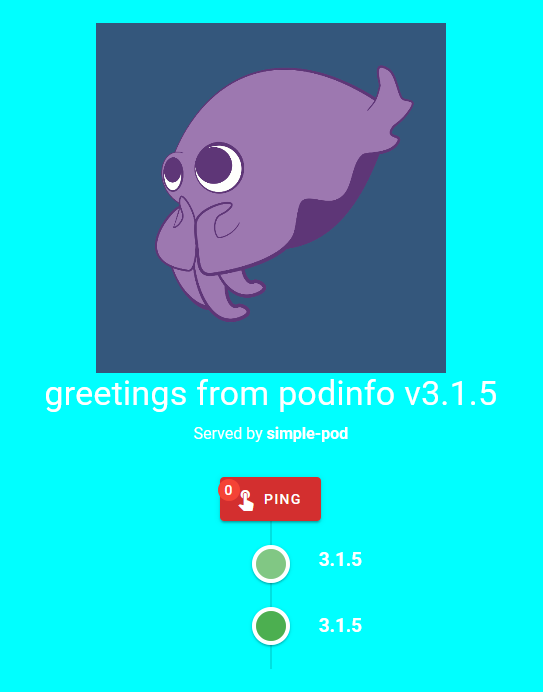

# Pods

## Creating a pod

```console
~/k8s-workshops $ kubectl apply -f 3-pods/pod.yml
pod/simple-pod created
```

```console
~/k8s-workshops $ kubectl get pods
NAME         READY   STATUS    RESTARTS   AGE
simple-pod   1/1     Running   0          50s
```

## Lack of durability

```console
~/k8s-workshops $ kubectl delete pod simple-pod
pod "simple-pod" deleted
```

```console
~/k8s-workshops $ kubectl get pods
No resources found in default namespace.
```

## Investigating a pod

```console
~/k8s-workshops $ kubectl apply -f 3-pods/pod.yml
pod/simple-pod created
```

```console
~/k8s-workshops $ kubectl get pod simple-pod -o yaml
apiVersion: v1
kind: Pod
...
```

```console
~/k8s-workshops $ kubectl describe pod simple-pod
Name:         simple-pod
Namespace:    default
Priority:     0
Node:         minikube/192.168.99.106
...
```

```console
~/k8s-workshops $ kubectl logs simple-pod
{"level":"info","ts":"2019-12-04T20:19:48.384Z","caller":"podinfo/main.go:120","msg":"Starting podinfo","version":"3.1.5","revision":"78658c03110c23dc011bbec5801f58c6f3f14420","port":"9898"}
```

## Executing commands inside pods/containers

```console
~/k8s-workshops $ kubectl exec -it simple-pod sh
~ $ ls
podinfo  ui
~ $ ps
PID   USER     TIME  COMMAND
    1 app       0:00 ./podinfo
   12 app       0:00 sh
   21 app       0:00 ps
~ $ exit
~/k8s-workshops $
```

```console
~/k8s-workshops $ kubectl delete pod simple-pod
pod "simple-pod" deleted
```

## Liveness probe

```console
~/k8s-workshops $ kubectl apply -f 3-pods/liveness-pod.yml
pod/liveness-pod created
```

```console
~/k8s-workshops $ kubectl exec -it liveness-pod -- curl -XPOST localhost:9898/readyz/disable
```

```console
~/k8s-workshops $ kubectl get pods -w
NAME           READY   STATUS    RESTARTS   AGE
liveness-pod   0/1     Pending   0          0s
liveness-pod   0/1     Pending   0          0s
liveness-pod   0/1     ContainerCreating   0          0s
liveness-pod   1/1     Running             0          3s
liveness-pod   1/1     Running             1          20s
```

```console
~/k8s-workshops $ kubectl describe pod liveness-pod
Name:         liveness-pod
...
Events:
  Type     Reason     Age                From               Message
  ----     ------     ----               ----               -------
...
  Warning  Unhealthy  30s (x3 over 36s)  kubelet, minikube  Liveness probe failed: HTTP probe failed with statuscode: 503
  Normal   Killing    30s                kubelet, minikube  Container liveness-pod failed liveness probe, will be restarted
...
```

```console
~/k8s-workshops $ kubectl delete pod liveness-pod
pod "liveness-pod" deleted
```

## Assigning CPU and memory resources to pods

```console
~/k8s-workshops $ kubectl apply -f 3-pods/resources-pod.yml
pod/resources-pod created
```

```console
~/k8s-workshops $ kubectl describe node minikube
Name:               minikube
Roles:              master
...
Conditions:
  Type             Status  LastHeartbeatTime                 LastTransitionTime                Reason                       Message
  ----             ------  -----------------                 ------------------                ------                       -------
  MemoryPressure   False   Wed, 04 Dec 2019 21:50:19 +0100   Wed, 04 Dec 2019 20:51:08 +0100   KubeletHasSufficientMemory   kubelet has sufficient memory available
  DiskPressure     False   Wed, 04 Dec 2019 21:50:19 +0100   Wed, 04 Dec 2019 20:51:08 +0100   KubeletHasNoDiskPressure     kubelet has no disk pressure
  PIDPressure      False   Wed, 04 Dec 2019 21:50:19 +0100   Wed, 04 Dec 2019 20:51:08 +0100   KubeletHasSufficientPID      kubelet has sufficient PID available
  Ready            True    Wed, 04 Dec 2019 21:50:19 +0100   Wed, 04 Dec 2019 20:51:08 +0100   KubeletReady                 kubelet is posting ready status
...
Capacity:
 cpu:                2
 ephemeral-storage:  17784772Ki
 hugepages-2Mi:      0
 memory:             1985620Ki
 pods:               110
Allocatable:
 cpu:                2
 ephemeral-storage:  17784772Ki
 hugepages-2Mi:      0
 memory:             1985620Ki
 pods:               110
...
Non-terminated Pods:         (10 in total)
  Namespace                  Name                                CPU Requests  CPU Limits  Memory Requests  Memory Limits  AGE
  ---------                  ----                                ------------  ----------  ---------------  -------------  ---
  default                    resources-pod                       1m (0%)       10m (0%)    16Mi (0%)        128Mi (6%)     31s
...
Allocated resources:
  (Total limits may be over 100 percent, i.e., overcommitted.)
  Resource           Requests     Limits
  --------           --------     ------
  cpu                756m (37%)   10m (0%)
  memory             206Mi (10%)  468Mi (24%)
  ephemeral-storage  0 (0%)       0 (0%)
Events:
  Type    Reason                   Age                From                  Message
  ----    ------                   ----               ----                  -------
  Normal  NodeHasSufficientMemory  59m (x8 over 59m)  kubelet, minikube     Node minikube status is now: NodeHasSufficientMemory
  Normal  NodeHasNoDiskPressure    59m (x7 over 59m)  kubelet, minikube     Node minikube status is now: NodeHasNoDiskPressure
  Normal  NodeHasSufficientPID     59m (x8 over 59m)  kubelet, minikube     Node minikube status is now: NodeHasSufficientPID
  Normal  Starting                 59m                kube-proxy, minikube  Starting kube-proxy.
```

```console
~/k8s-workshops $ kubectl delete pod resources-pod
pod "resources-pod" deleted
```

```console
~/k8s-workshops $ kubectl apply -f 3-pods/greedy-pod.yml
pod/greedy-pod created
```

```console
~/k8s-workshops $ kubectl get pods
NAME         READY   STATUS    RESTARTS   AGE
greedy-pod   0/1     Pending   0          5s
```

```console
~/k8s-workshops $ kubectl describe pod greedy-pod
Name:         greedy-pod
...
Events:
  Type     Reason            Age        From               Message
  ----     ------            ----       ----               -------
  Warning  FailedScheduling  <unknown>  default-scheduler  0/1 nodes are available: 1 Insufficient cpu, 1 Insufficient memory.
```

```console
~/k8s-workshops $ kubectl delete pod greedy-pod
pod "greedy-pod" deleted
```

## Forwarding port to a pod

```console
~/k8s-workshops $ kubectl apply -f 3-pods/pod.yml
pod/simple-pod created
```

```console
~/k8s-workshops $ kubectl port-forward pod/simple-pod 9898:9898
Forwarding from 127.0.0.1:9898 -> 9898
Forwarding from [::1]:9898 -> 9898
Handling connection for 9898
```

`localhost:9898`



```console
~/k8s-workshops $ kubectl delete pod simple-pod
pod "simple-pod" deleted
```
