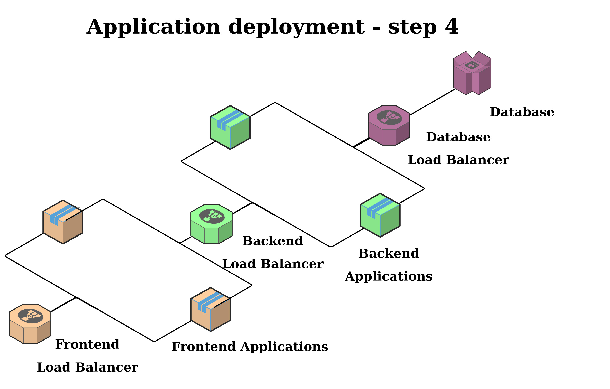

# Exercise

Ok, now you're going to use existing docker images to build your own Kubernetes cluster.  
Few things that may come in handy:  

1. Start minikube with 4GB of memory using this command: `minikube start --memory=4g`.
2. Every application needs to be exposed by some kind of load balancer to provide access to pods using DNS.
3. You can access your minikube dashboard with `minikube dashboard` command.
4. If you're having troubles resist your urge to decompile provided jars in docker images. Just ask for some help! :)

## Final expected result

When you open your browser and navigate to `http://<minikube_ip>:30000` there should be an application displayed. Login using `astronaut/moon` credentials, click on `START` and new rocket appears on the right!

## Mongo Database


### Essential values

Docker image: `mongo`  
Port: `27017`

That's actually all you need to provide Mongo database in your cluster.  

### Verification

Forward a 27017 port to 'load balancer' and access it in your browser.  
`http://localhost:27017`

```text
It looks like you are trying to access MongoDB over HTTP on the native driver port.
```

## Backend (Spring Boot)


### Essential values

Docker image: `k8sworkshopharman/backend-service:latest`  
Port: `8080`

### Available environment variables

`SPRING_DATA_MONGODB_HOST`  
`SPRING_DATA_MONGODB_PORT`

### Alternative way to provide properties

Internal location of properties file:  
`/app/config/application.properties`

Available properties:  
`spring.data.mongodb.host`  
`spring.data.mongodb.port`

### Verification

Forward a 8080 port to 'load balancer' and access it in your browser.  

`http://localhost:8080/actuator/health`

```json
{"status":"UP"}
```

`http://localhost:8080/actuator/help`

```json
{"spring.data.mongodb.host":<CONFIDENTIAL>,"spring.data.mongodb.port":<CONFIDENTIAL>}
```

## Frontend (Spring Boot)


### Essential values

Docker image: `k8sworkshopharman/frontend-service:latest`  
Port: `8888`

### Environment variables

`WORKSHOP_BACKEND_HOST`  
`WORKSHOP_BACKEND_PORT`  
`WORKSHOP_USERNAME`  
`WORKSHOP_PASWORD`

### Alternative way to provide properties

Internal location of properties file:  
`/app/config/application.properties`

Properties possible to set:  
`workshop.username`  
`workshop.password`  
`workshop.backend.host`  
`workshop.backend.port`

### Verification
  
`http://<minikube_ip>:30000/actuator/health`

```json
{"status":"UP"}
```

`http://<minikube_ip>:30000/actuator/help`

```json
{"backend":{"workshop.backend.host":<CONFIDENTIAL>,"workshop.backend.port":<CONFIDENTIAL>},"workshop.username":<CONFIDENTIAL>,"workshop.password":<CONFIDENTIAL>}
```

## Additional effort

Everything above is sufficient to finish the task.  
But if it was too easy or you just want to hang around some more here are some additional tasks:

### Don't lose your Mongo data after container restart

Mongo's data is stored in internal directory `/var/lib/mongo`

### Scale up your resources



Your backend and frontend should have 2 replicas each.  
After you do it, go to frontend and start sending many, many rockets into space. The hostnames should differ.

### Readiness and Liveness probes

Configure them for your Kubernetes resources

#### Mongo

Use this command to check if Mongo is healthy [(more details here)](https://kubernetes.io/docs/tasks/configure-pod-container/configure-liveness-readiness-startup-probes/#define-a-liveness-command)

```bash
mongo --eval "db.adminCommand('ping')"
```

#### Backend

Check Backend's health by using this GET endpoint

```text
localhost:8080/actuator/health
```

#### Frontend

Check Frontend's health by using this GET endpoint

```text
localhost:8888/actuator/health
```

### Requests and Limits

The backend and frontend seems too hungry for resources.  
We believe `320Mi` should be enough maximum value for each pod.

